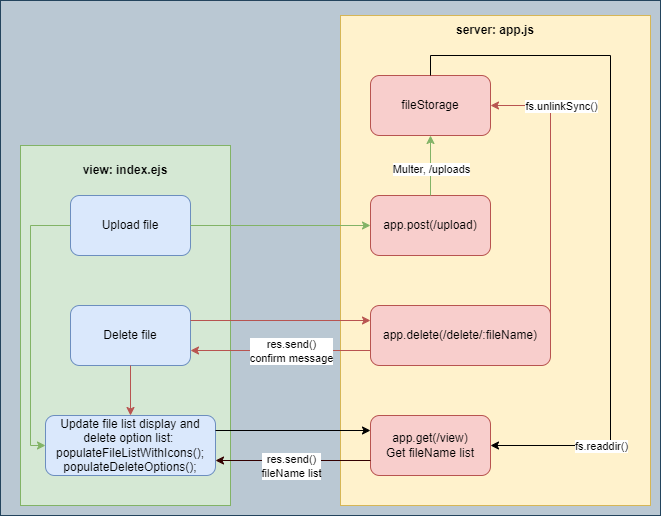

# gfg-file-storage: React Single File Upload with Multer and Express.js
`Node.js` `Express.js` `React` `Multer`

### Run command: 
```
npm start
```
### Install Packages
```
npm install express multer ejs
```
### package.json
```
{
  "name": "gfg-filestorage",
  "version": "0.1.0",
  "description": "",
  "main": "app.js",
  "scripts": {
    "test": "echo \"Error: no test specified\" && exit 1",
    "start": "node app.js"
  },
  "keywords": [],
  "author": "",
  "license": "ISC",
  "dependencies": {
    "ejs": "^3.1.10",
    "express": "^4.19.2",
    "multer": "^1.4.5-lts.1"
  }
}
```
### gfg-file-storage Design

