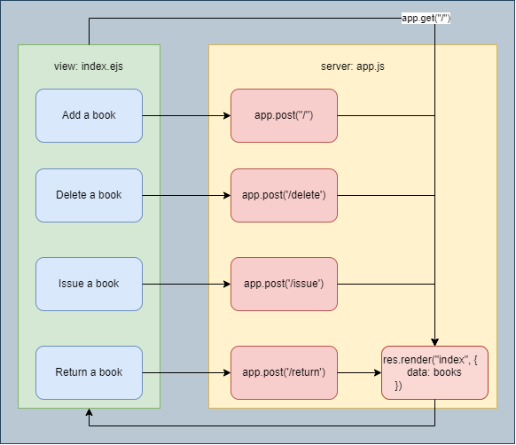

# library-management-system: This app will used to manage the book record of a Library, where a librarian can view all the available books, add new books, delete books, issue books, and return books.
`Node.js` `Express.js`

### Run command: 
```
node app.js
```
### Install Packages
```
npm install express ejs body-parser
```
### library-management-system Design

