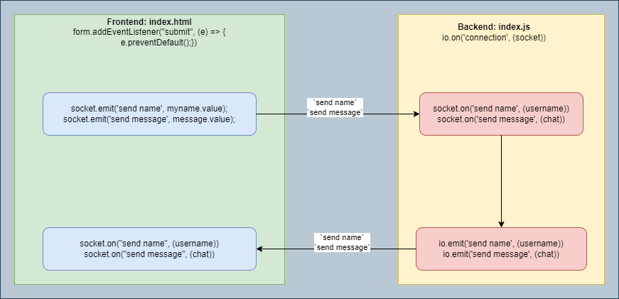

# socket-chat-app: Chat App using socket.io
`Node.js` `Express.js` `Socket.IO`

### Run command: 
```
node ./index.js
```

### Express App
```
const express = require('express');
const app = express();

// Define routes and middleware here
// ...

const PORT = process.env.PORT || 3000;
app.listen(PORT, () => {
    console.log(`Server running on port ${PORT}`);
});

```

### Design

